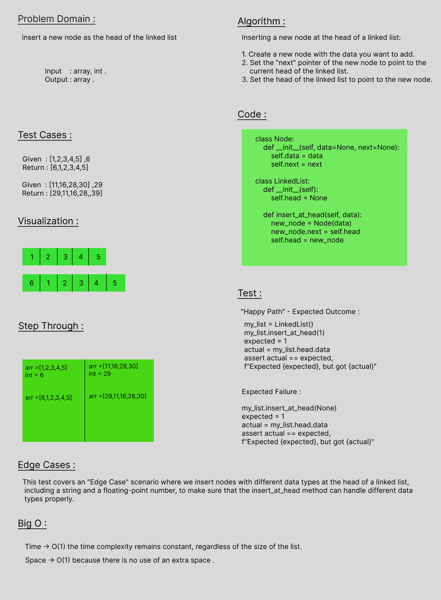
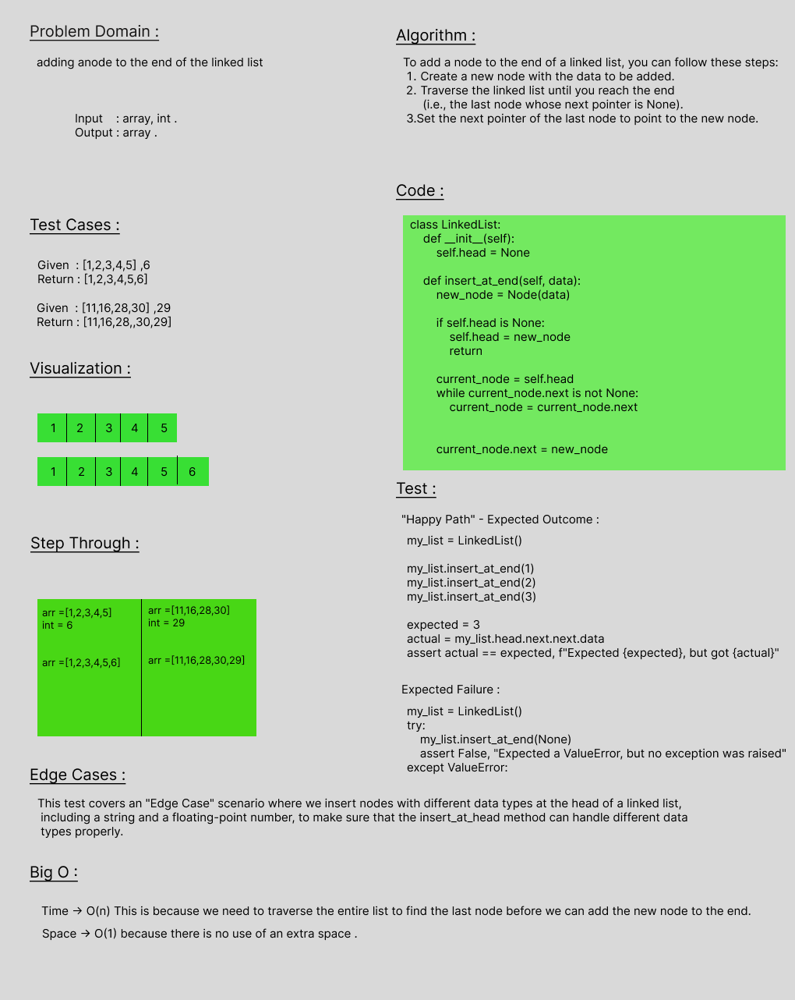
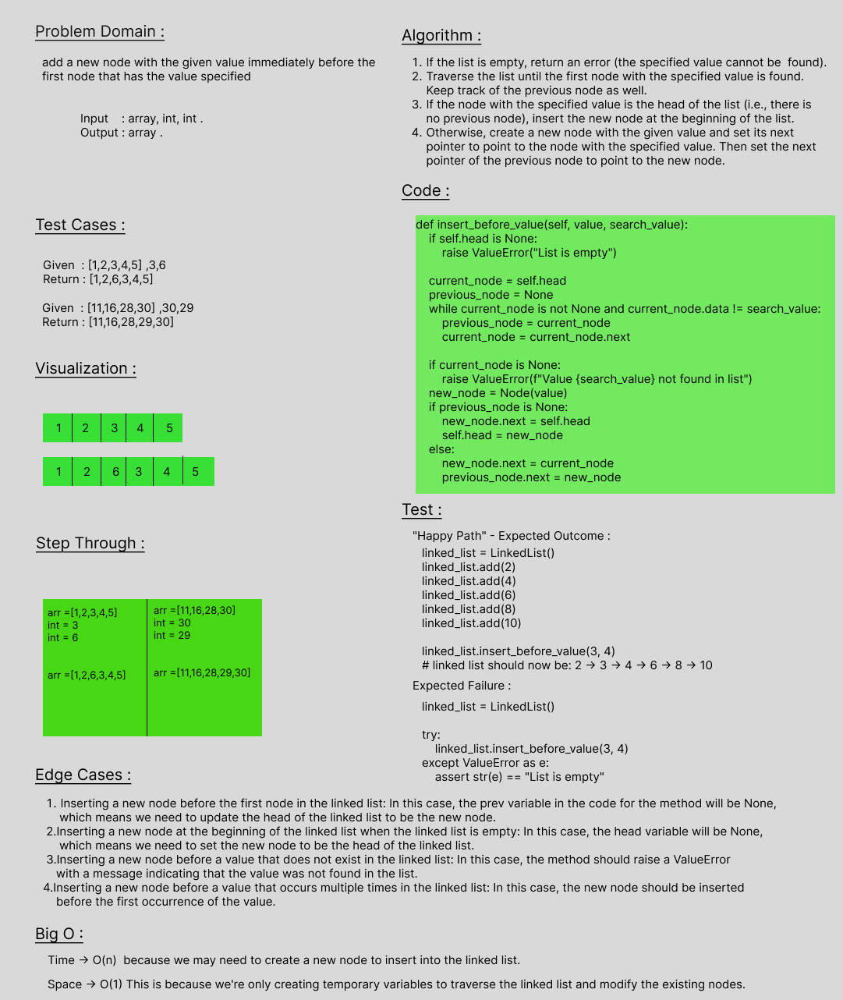
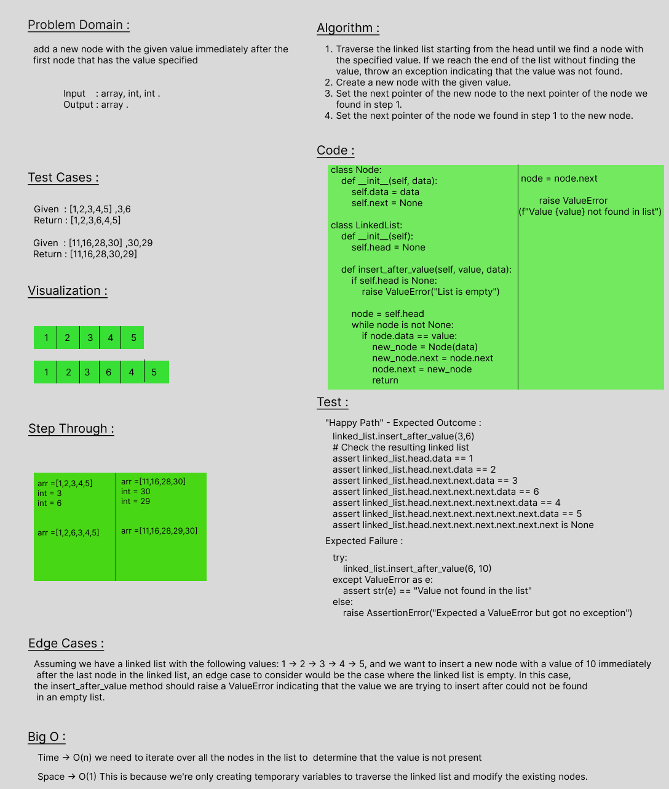

# Linked List

> - create a Linked list class that insert into the beginning

## Whiteboard Process

### insert



### append



### insert before



### insert after



## Approach & Efficiency

> - Time --> O(n) 
> - space -->O(1) 

## Solution

```class Node:
    def __init__(self,value):
        self.value=value
        self.next = None

class LinkedList:
    def __init__(self):
        self.head = None

    def insert (self,value):
           node = Node(value)
           if self.head == None:
                self.head = node
           else:
                node.next = self.head
                self.head = node

    def includes (self,key):
         temp = self.head
         if temp is None:
              return False
         while temp is not None:
              if temp.value == key:
                   return True
              temp = temp.next
         if temp is None:
              return False

    def __str__(self):
        output = ""
        if self.head is None:
            output = "Empty LinkeList"
        else:
            current = self.head
            while(current):
                output += f'{current.value} -> '
                current = current.next

            output += " Null"
        return output
```