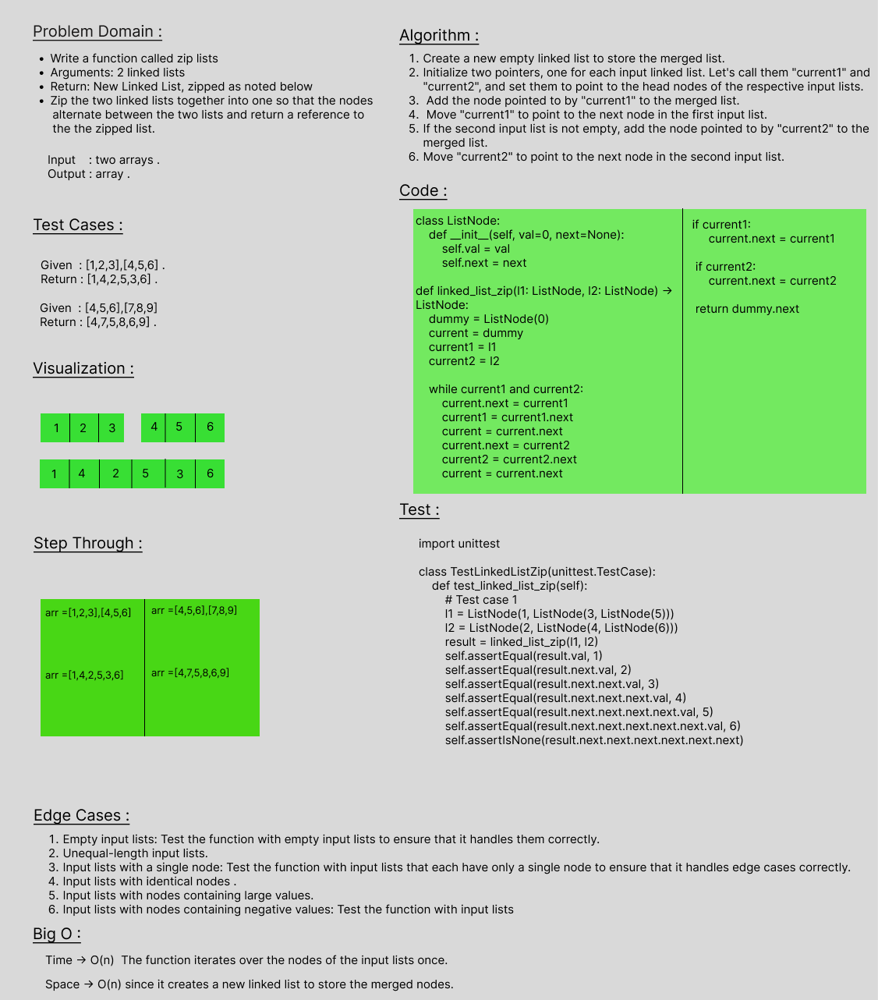

# linked-list-zip
Write a function called zip lists
Arguments: 2 linked lists
Return: New Linked List, zipped as noted below
Zip the two linked lists together into one so that the nodes alternate between the two lists and return a reference to the the zipped list.

## Whiteboard Process

## Approach & Efficiency
Time -> O(n)  The function iterates over the nodes of the input lists once. 
Space -> O(n) since it creates a new linked list to store the merged nodes.

## Solution
    class ListNode:
    def __init__(self, val=0, next=None):
        self.val = val
        self.next = next

    def linked_list_zip(l1: ListNode, l2: ListNode) -> ListNode:
    dummy = ListNode()
    current = dummy
    current1, current2 = l1, l2
    
    while current1 and current2:
        current.next = current1
        current1 = current1.next
        current = current.next
        current.next = current2
        current2 = current2.next
        current = current.next
        
    if current1:
        current.next = current1
        
    if current2:
        current.next = current2
        
    return dummy.next
