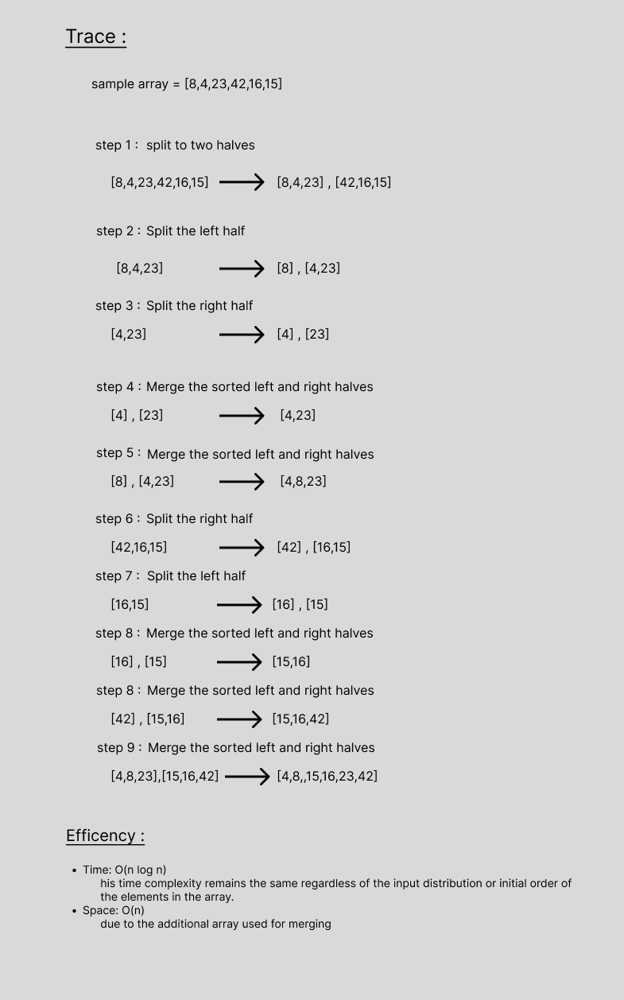

# Merge Sort
Convert the pseudo-code into python code .

 

## visual step through

 

## Approach & Efficiency
Time: O(n log n)
           his time complexity remains the same regardless of the input distribution or initial order of
           the elements in the array.
Space: O(n)
           due to the additional array used for merging

 

## Solution

    def merge_sort(arr):
        n = len(arr)

        if n > 1:
            mid = n // 2
            left = arr[:mid]
            right = arr[mid:]

            merge_sort(left)
            merge_sort(right)

            merge(left, right, arr)
        return arr

    def merge(left, right, arr):
        i = j = k = 0

        while i < len(left) and j < len(right):
            if left[i] <= right[j]:
                arr[k] = left[i]
                i += 1
            else:
                arr[k] = right[j]
                j += 1

            k += 1

        while i < len(left):
            arr[k] = left[i]
            i += 1
            k += 1

        while j < len(right):
            arr[k] = right[j]
            j += 1
            k += 1
