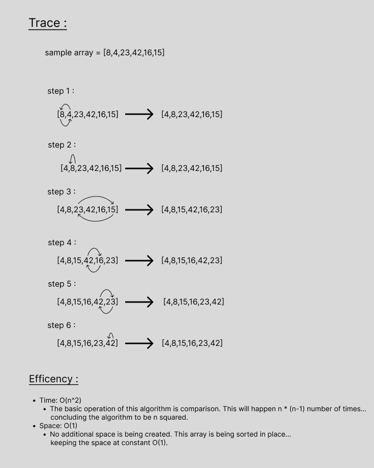

# Insertion Sort
Convert the pseudo-code into python code .

 

## visual step through

 

## Approach & Efficiency
Time: O(n^2)
The basic operation of this algorithm is comparison. This will happen n * (n-1) number of times…
concluding the algorithm to be n squared.
Space: O(1)
No additional space is being created. This array is being sorted in place…
keeping the space at constant O(1).

 

## Solution

    def selection_sort(arr):
        n = len(arr)
        for i in range(n - 1):
            min_idx = i
            for j in range(i + 1, n):
                if arr[j] < arr[min_idx]:
                    min_idx = j

            arr[min_idx], arr[i] = arr[i], arr[min_idx]

        return arr
