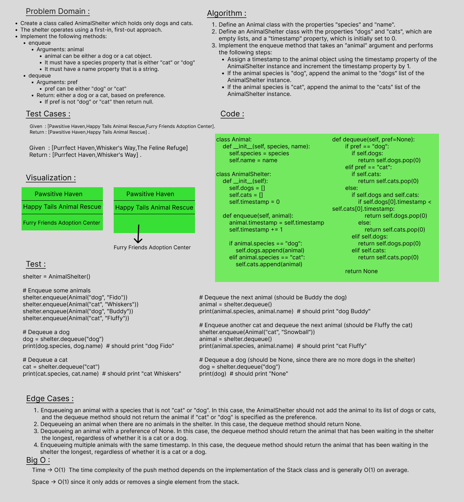

# stack-queue-animal-shelter
Create a class called AnimalShelter which holds only dogs and cats.
The shelter operates using a first-in, first-out approach.
Implement the following methods:
enqueue
Arguments: animal
animal can be either a dog or a cat object.
It must have a species property that is either "cat" or "dog"
It must have a name property that is a string.
dequeue
Arguments: pref
pref can be either "dog" or "cat"
Return: either a dog or a cat, based on preference.
If pref is not "dog" or "cat" then return null.

 

## Whiteboard Process

 

## Approach & Efficiency
Time -> O(1)  The time complexity of the push method depends on the implementation of the Stack class and is generally O(1) on average.
Space -> O(1) since it only adds or removes a single element from the stack.

 

## Solution
class Animal:
    def __init__(self, species, name):
        self.species = species
        self.name = name

class AnimalShelter:
    def __init__(self):
        self.dogs = []
        self.cats = []
        self.timestamp = 0
    
    def enqueue(self, animal):
        animal.timestamp = self.timestamp
        self.timestamp += 1
        
        if animal.species == "dog":
            self.dogs.append(animal)
        elif animal.species == "cat":
            self.cats.append(animal)
    
    def dequeue(self, pref=None):
        if pref == "dog":
            if self.dogs:
                return self.dogs.pop(0)
        elif pref == "cat":
            if self.cats:
                return self.cats.pop(0)
        else:
            if self.dogs and self.cats:
                if self.dogs[0].timestamp < self.cats[0].timestamp:
                    return self.dogs.pop(0)
                else:
                    return self.cats.pop(0)
            elif self.dogs:
                return self.dogs.pop(0)
            elif self.cats:
                return self.cats.pop(0)
        
        return None

