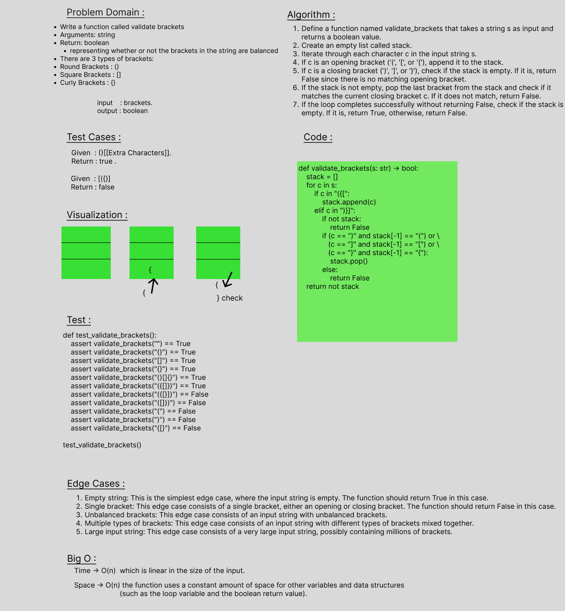

# stack-queue-brackets
Write a function called validate brackets
Arguments: string
Return: boolean
representing whether or not the brackets in the string are balanced
There are 3 types of brackets:
Round Brackets : ()
Square Brackets : []
Curly Brackets : {}

 

## Whiteboard Process

 

## Approach & Efficiency
Time -> O(n)  which is linear in the size of the input.
Space -> O(n) the function uses a constant amount of space for other variables and data structures (such as the loop variable and the boolean return value).

 

## Solution

    def validate_brackets(s: str) -> bool:
        stack = []
        for c in s:
            if c in "({[":
                stack.append(c)
            elif c in ")}]":
                if not stack:
                    return False
                if (c == ")" and stack[-1] == "(") or \
                (c == "]" and stack[-1] == "[") or \
                (c == "}" and stack[-1] == "{"):
                    stack.pop()
                else:
                    return False
        return not stack
