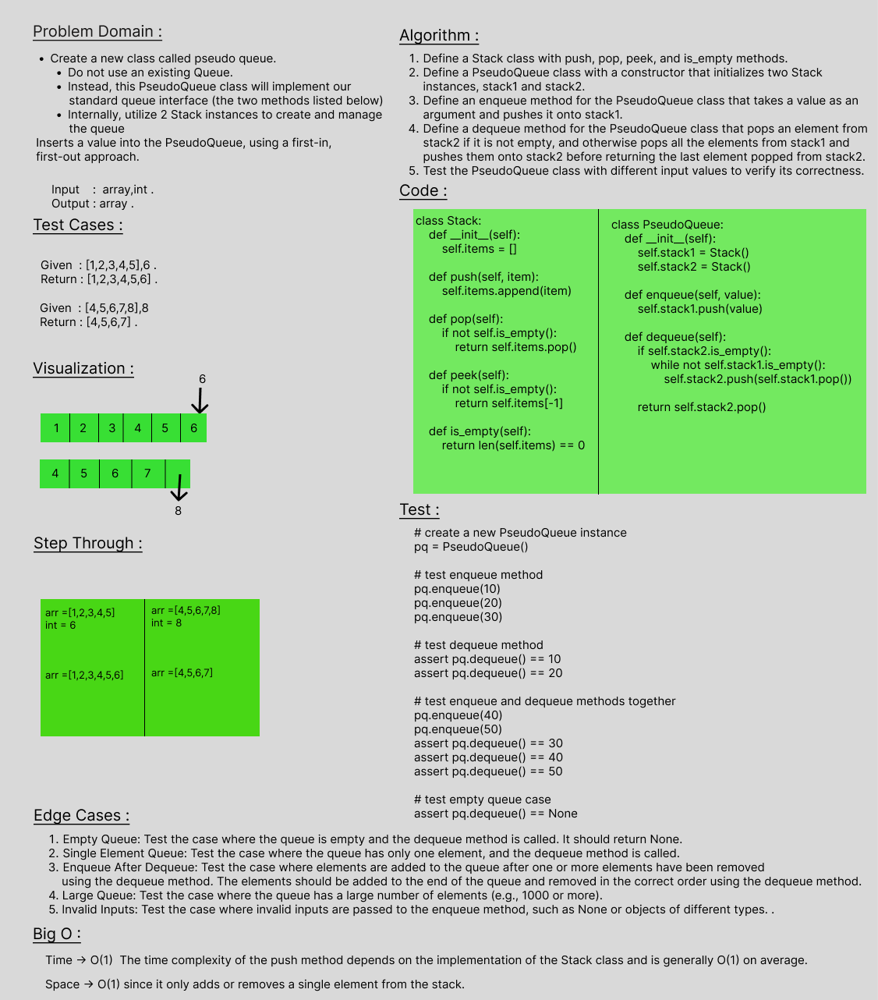

# stack-queue-pseudo
enqueue
Arguments: value
Inserts a value into the PseudoQueue, using a first-in, first-out approach.
dequeue
Arguments: none
Extracts a value from the PseudoQueue, using a first-in, first-out approach.

 

## Whiteboard Process

 

## Approach & Efficiency
Time -> O(1)  The time complexity of the push method depends on the implementation of the Stack class and is generally O(1) on average.
Space -> O(1) since it only adds or removes a single element from the stack.

 

## Solution
class Stack:
    def __init__(self):
        self.items = []

    def push(self, item):
        self.items.append(item)

    def pop(self):
        if not self.is_empty():
            return self.items.pop()

    def peek(self):
        if not self.is_empty():
            return self.items[-1]

    def is_empty(self):
        return len(self.items) == 0

class PseudoQueue:
    def __init__(self):
        self.stack1 = Stack()
        self.stack2 = Stack()

    def enqueue(self, value):
        self.stack1.push(value)

    def dequeue(self):
        if self.stack2.is_empty():
            while not self.stack1.is_empty():
                self.stack2.push(self.stack1.pop())

        return self.stack2.pop()
