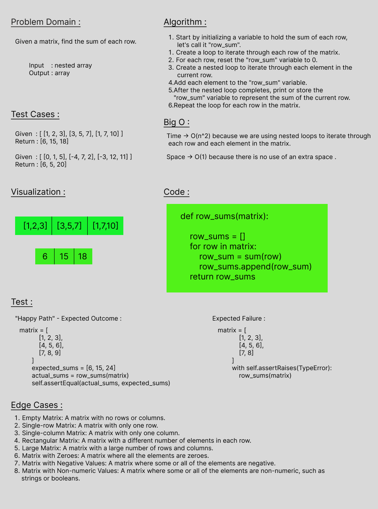

# Challenge Title
Given a matrix, find the sum of each row,Without utilizing any of the built-in methods available to your language, return an array with the new value added at the middle index.

 

## Whiteboard Process

 

## Approach & Efficiency
Time -> O(n^2)
 
Space -> O(1)

  

## Solution
    def row_sums(matrix):
       row_sums = []
       for row in matrix:
        row_sum = sum(row)
        row_sums.append(row_sum)
    return row_sums

