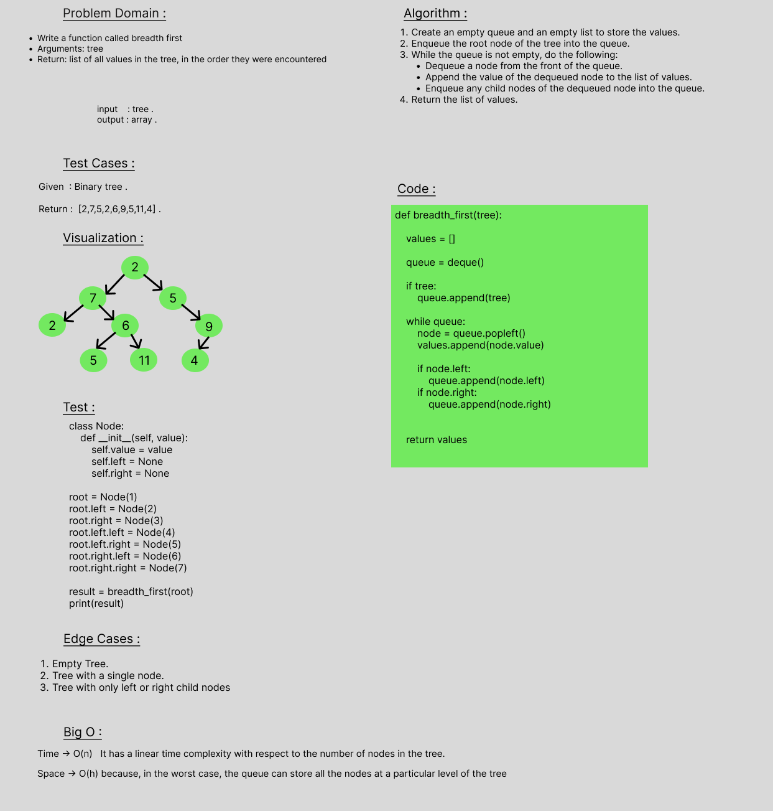

# Breadth-first Traversal.
Write a function called breadth first
Arguments: tree
Return: list of all values in the tree, in the order they were encountered

 

## Whiteboard Process

 

## Approach & Efficiency
Time -> O(n)   It has a linear time complexity with respect to the number of nodes in the tree.
Space -> O(h) because, in the worst case, the queue can store all the nodes at a particular level of the tree.

 

## Solution
def breadth_first(tree):
  
    values = []

    queue = deque()

    if tree:
        queue.append(tree)

    while queue:
 
        node = queue.popleft()
        values.append(node.value)
       
        if node.left:
            queue.append(node.left)
        if node.right:
            queue.append(node.right)

   
    return values
