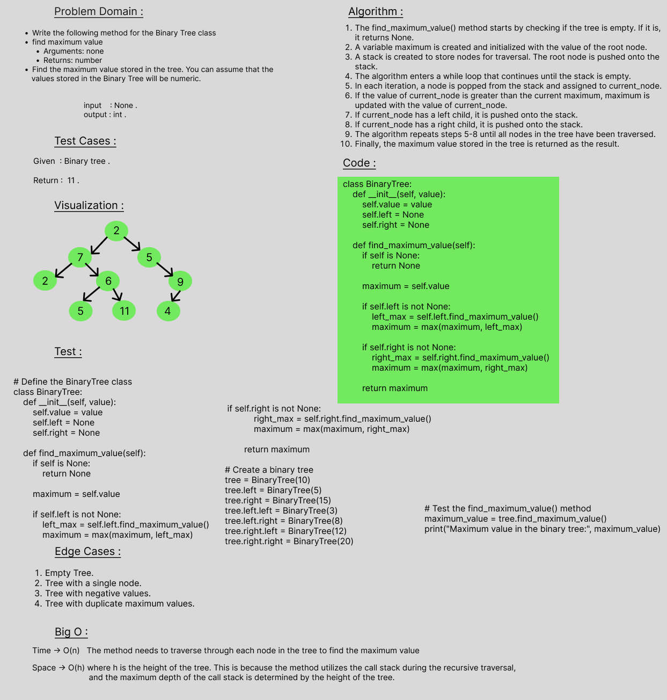

# tree-max
Find the Maximum Value in a Binary Tree

 

## Whiteboard Process

 

## Approach & Efficiency
Time -> O(n)   The method needs to traverse through each node in the tree to find the maximum value 
Space -> O(h) where h is the height of the tree. This is because the method utilizes the call stack during the recursive traversal, 
              and the maximum depth of the call stack is determined by the height of the tree.

 

## Solution

    class BinaryTree:
        def __init__(self, value):
            self.value = value
            self.left = None
            self.right = None

        def find_maximum_value(self):
            if self is None:
                return None

            maximum = self.value

            if self.left is not None:
                left_max = self.left.find_maximum_value()
                maximum = max(maximum, left_max)

            if self.right is not None:
                right_max = self.right.find_maximum_value()
                maximum = max(maximum, right_max)

            return maximum
